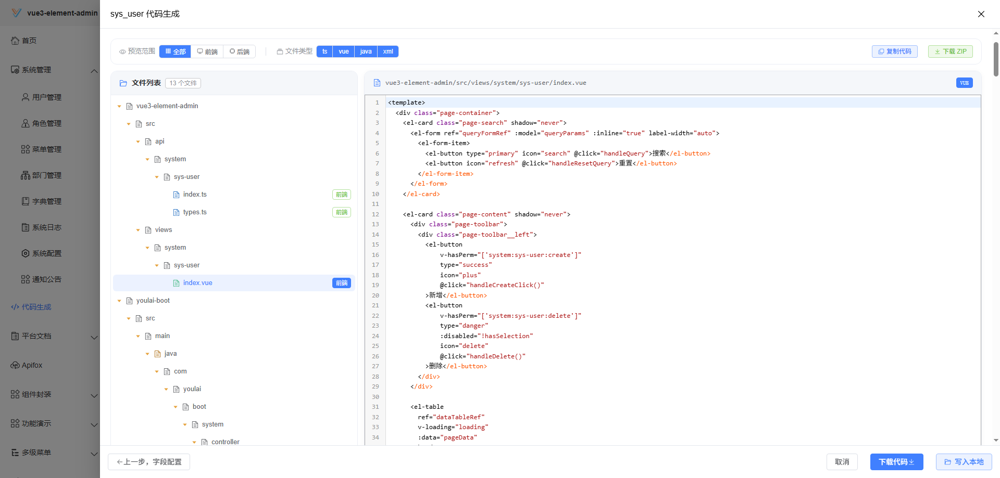
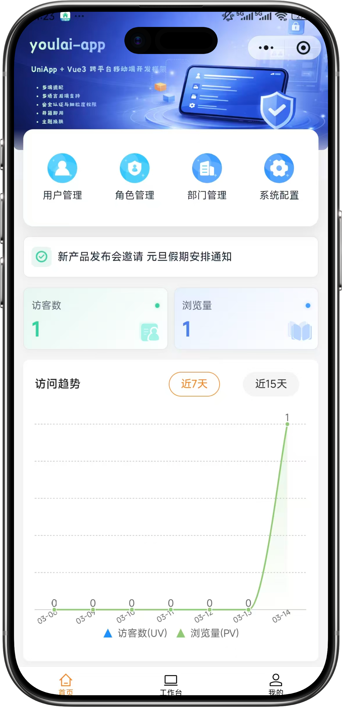

<div align="center">


# youlai-gin

**Go/Gin 企业级权限管理系统后端**

[](https://go.dev/)
[](https://gin-gonic.com/)
[](LICENSE)
[](https://gitee.com/youlaiorg/youlai-gin/stargazers)
[](https://github.com/youlaitech/youlai-gin)
[](https://gitcode.com/youlai/youlai-gin/stargazers)

</div>


<div align="center">

[🖥️ 在线预览](https://vue.youlai.tech) | [📲 移动端预览](https://app.youlai.tech) | [📖 文档](https://www.youlai.tech/docs/admin/backend/go/)

</div>

## 简介

**youlai-gin** 是一套基于 Go/Gin 的企业级权限管理系统后端，配套前端 [vue3-element-admin](https://gitee.com/youlaiorg/vue3-element-admin) 和移动端 [youlai-app](https://gitee.com/youlaiorg/youlai-app)，并提供 **6 种语言实现**（Java / Node.js / Go / Python / PHP / C#），共享同一套 API 规范与数据库结构。适用于企业中后台管理系统的学习参考与二次开发。

## 核心特性

- 🔐 **安全体系** — JWT + Redis Token 双会话模式、令牌续期、多端互斥
- 🛡️ **细粒度权限** — RBAC 权限模型，菜单/按钮/接口统一治理
- ⚡ **代码生成器** — 一键生成前后端 CRUD 代码
- 📦 **模块齐全** — 用户、角色、菜单、部门、字典、文件、消息中心、操作日志
- 🔌 **实时通信** — SSE 推送：在线用户数、字典同步、通知广播

## 系统预览

**PC 端**

<table align="center">
  <tr>
    <td></td>
    <td></td>
  </tr>
  <tr>
    <td></td>
    <td></td>
  </tr>
  <tr>
    <td></td>
    <td></td>
  </tr>
</table>

**移动端**

<table align="center">
  <tr>
    <td></td>
    <td></td>
    <td></td>
    <td></td>
  </tr>
</table>

## 快速开始

**环境要求**：Go 1.25+ · MySQL 8.0+ · Redis 7.x+

1. 克隆项目：`git clone https://gitee.com/youlaiorg/youlai-gin.git`
2. 导入数据库：`sql/mysql/youlai_admin.sql`
3. 修改配置（可选，默认已配置线上只读数据源）：`configs/dev.yaml`
4. 安装依赖：`go mod tidy`
5. 启动服务：`go run main.go`，访问 http://localhost:8000/swagger/index.html

默认账号：`admin` / `123456`

> 💡 **热重载**：推荐使用 `air` 工具，先 `go install github.com/cosmtrek/air@latest`，再 `air`

详细指南：[部署文档](https://www.youlai.tech/docs/admin/backend/go/deploy)

## 技术栈

| 技术 | 版本 | 说明 |
|:-----|:-----|:-----|
| Go | 1.25+ | 核心语言 |
| Gin | 1.11 | Web 框架 |
| GORM | — | ORM 框架 |
| MySQL | 5.7+ / 8.x | 数据库 |
| Redis | 7.x+ | 缓存 · 会话 |
| Swagger | — | API 文档 |

## 目录结构

```
youlai-gin/
├── internal/                       # 私有应用代码
│   ├── auth/                       # 认证模块（登录/Token/会话）
│   ├── codegen/                    # 代码生成模块
│   ├── common/                     # 公共模块（数据库/Redis/权限/工具）
│   ├── file/                       # 文件管理模块
│   ├── message/                    # SSE 消息推送
│   ├── middleware/                 # 中间件（JWT/CORS/限流）
│   ├── router/                     # 路由注册
│   └── system/                     # 系统模块（用户/角色/菜单/部门）
├── pkg/                            # 可被外部使用的公共库
│   ├── constant/                   # 常量定义
│   ├── enums/                      # 枚举类型
│   ├── errs/                       # 统一错误类型
│   ├── model/                      # 通用模型（分页/选项/实体）
│   └── types/                      # 自定义类型（BigInt/LocalTime）
├── configs/                        # 配置文件（dev/prod/test）
├── sql/                            # 数据库初始化脚本
├── main.go                         # 应用入口
└── Dockerfile                      # Docker 镜像构建文件
```

## 生态矩阵

**前端**

| 项目 | 技术栈 | 说明 |
|:-----|:-------|:-----|
| [vue3-element-admin](https://gitee.com/youlaiorg/vue3-element-admin) | Vue 3 + Element Plus | PC 管理前端（主推） |
| [youlai-app](https://gitee.com/youlaiorg/youlai-app) | Vue 3 + UniApp | 移动端 App |

**后端**

| 项目 | 技术栈 | 说明 |
|:-----|:-------|:-----|
| [youlai-boot](https://gitee.com/youlaiorg/youlai-boot) | Spring Boot 4 + MyBatis-Plus | Java（主推） |
| [youlai-nest](https://gitee.com/youlaiorg/youlai-nest) | NestJS + TypeORM | Node.js |
| [youlai-django](https://gitee.com/youlaiorg/youlai-django) | Django + DRF | Python |
| [youlai-thinkphp](https://gitee.com/youlaiorg/youlai-thinkphp) | ThinkPHP 8 | PHP |
| [youlai-aspnet](https://gitee.com/youlaiorg/youlai-aspnet) | ASP.NET Core | C# |

> **youlai-boot** 还提供以下变种和分支版本：[多租户](https://gitee.com/youlaiorg/youlai-boot-tenant)（Spring Boot 4）· [MyBatis-Flex](https://gitee.com/youlaiorg/youlai-boot-flex)（Spring Boot 4）· [Spring Boot 3](https://gitee.com/youlaiorg/youlai-boot/tree/spring-boot-3) · [PostgreSQL](https://gitee.com/youlaiorg/youlai-boot/tree/db-pg) · [多模块](https://gitee.com/youlaiorg/youlai-boot/tree/multi-module)
>
> 六种后端共享同一套 **RESTful API 规范** 和 **数据库结构**，前端可无缝切换。

## 文档资源

| 资源 | 地址 |
|:-----|:-----|
| 📖 完整文档站 | [www.youlai.tech/docs/admin](https://www.youlai.tech/docs/admin/) |
| 🖥️ PC 端在线预览 | [vue.youlai.tech](https://vue.youlai.tech) |
| 📱 移动端在线预览 | [app.youlai.tech](https://app.youlai.tech) |
| 🔗 Apifox 接口文档 | [apifox.com](https://www.apifox.cn/apidoc/shared-195e783f-4d85-4235-a038-eec696de4ea5) |
| 🔗 本地接口文档 | [localhost:8000/swagger/index.html](http://localhost:8000/swagger/index.html) |

## 参与贡献

欢迎提交 Issue 和 Pull Request！详见 [贡献指南](https://www.youlai.tech/docs/admin/faq/help)。

## 开源协议

本项目基于 [Apache License 2.0](LICENSE) 开源，可免费用于商业项目。

---

<table align="center">
  <tr>
    <td align="center">
      <br>
      <sub>公众号「有来技术」</sub>
    </td>
    <td>&nbsp;&nbsp;&nbsp;&nbsp;</td>
    <td align="center">
      <br>
      <sub>小程序「有来技术」</sub>
    </td>
    <td>&nbsp;&nbsp;&nbsp;&nbsp;</td>
    <td align="center">
      <br>
      <sub>添加作者微信</sub>
    </td>
  </tr>
</table>

<p align="center"><em>技术交流 · 问题反馈 · 商务合作</em></p>
